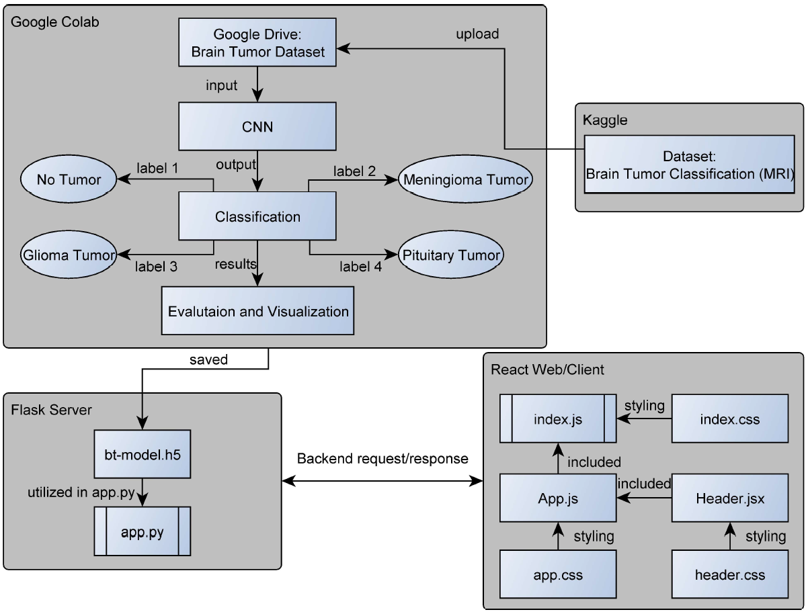

  <kbd>
    
  </kbd>

 <h1>Brain Tumor Image Classification - Web Application</h1>

    <h2>Table of Contents</h2>
    <ol>
        <li><a href="#introduction">Introduction</a></li>
        <li><a href="#features">Features</a></li>   
        <li><a href="#file-structure">File Structure</a></li>
        <li><a href="#architecture">Architecture</a></li>
        <li><a href="#technologies-used">Technologies Used</a></li>
        <li><a href="#installation-guide">Installation Guide</a></li>
        <li><a href="#testing">Testing</a></li>         
        <li><a href="#bugs-and-feature-request">Bugs and Feature Requests</a></li>
        <li><a href="#authors">Authors</a></li>
        <li><a href="#license">License</a></li>
    </ol>

## Introduction

This web application is designed to classify brain tumor images in MRI scans. It utilizes a machine learning model, created and trained in google colab, to predict whether a given image contains a glioma tumor, meningioma tumor, pituitary tumor, or no tumor. Furthermore, it hightlights the tumor by displaying a red border around the identified tumor.

## Features

- Upload multiple MRI images for classification.
- View uploaded images.
- View the classification results for each uploaded image.
- View highlighed tumor areas in each of the uploaded images.

## File Structure

- **client:** Contains frontend code written in React.js.
- **server:** Contains backend code written in Flask.

## Architecture

  

## Technologies Used

- **Requirements:**
  - node.js version: v18.12.1
  - Python version: 3.11.2
  - Flask version: 3.0.3
  - Chrome version: 124.0.6367.119
  - Windows 11 OS

- **Frontend:**
  - React.js for building the user interface.

- **Backend:**
  - Flask for building the API endpoints.
  - TensorFlow and Keras for image classification.
  - OpenCV for image processing.
  - Flask-CORS for enabling cross-origin resource sharing.

## Installation Guide

To run this project locally, follow these steps:

1. Clone this repository to your local machine.
2. Navigate to the project root directory.
3. Install dependencies for both the frontend and backend:
    - frontend
      - cd client
      - npm install
      - npm run build
    - backend 
      - cd server
      - pip install -r requirements.txt
4. Start the Application:
    - cd server
    - python app.py

5. Open your browser and visit http://localhost:5000 to view the application.

## Testing

  - the ./img/test_img_true directory provides successfully classified and highlighted images for testing 
  - the ./img/test_img_false provides falsly classified and highlighted images for testing 
  - Example of Meningioma Tumor Classification:
    

      
    

## Bugs and Feature Request

If you find a bug, kindly open an issue [here](https://github.com/NaBo-00/brain-tumor-multi-classification/issues/new) by including a description of your identified bug as well as how to reproduce it.

If you would like to request a new feature, feel free to do so by opening an issue [here](https://github.com/NaBo-00/brain-tumor-multi-classification/issues/new). Please include a description of your required functionalities as well as the expected outcome.

## Authors

- [Nareg B.](https://github.com/NaBo-00)

## License

This project is licensed under the [MIT License](https://github.com/NaBo-00/brain-tumor-multi-classification/blob/master/LICENSE).

---
Made by NaBo-00 | Copyright (c) NaBo-00

<!--Made by Na-Bo00 --!>

